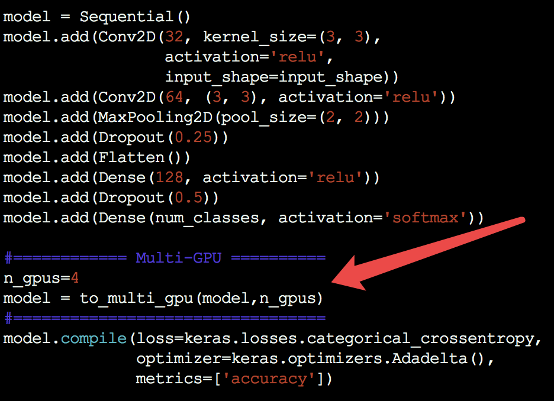

# Keras_Multi_GPU
Multi-GPU training for Keras

# Usage

```python
from multi_gpu import to_multi_gpu

# Add the one line code before model.compile()
model = to_multi_gpu(model,n_gpus=4) 
```




# Example

Environment:
  - Keras-2.0.4
  - Tensorflow-1.1.0
  - Ubuntu 14.04
  - 1080Ti, K80

Test on 2 1080Ti GPUs with:
```python
model = to_multi_gpu(model,n_gpus=2) 
```


```
$ CUDA_VISIBLE_DEVICES=0,1 python mnist_cnn.py

60000/60000 [==============================] - 9s - loss: 0.3368 - acc: 0.8978 - val_loss: 0.0734 - val_acc: 0.9768
Epoch 2/12
60000/60000 [==============================] - 5s - loss: 0.1134 - acc: 0.9660 - val_loss: 0.0518 - val_acc: 0.9837
Epoch 3/12
60000/60000 [==============================] - 5s - loss: 0.0850 - acc: 0.9746 - val_loss: 0.0419 - val_acc: 0.9856
Epoch 4/12
60000/60000 [==============================] - 5s - loss: 0.0709 - acc: 0.9794 - val_loss: 0.0364 - val_acc: 0.9870
Epoch 5/12
60000/60000 [==============================] - 5s - loss: 0.0626 - acc: 0.9816 - val_loss: 0.0328 - val_acc: 0.9892
Epoch 6/12
60000/60000 [==============================] - 5s - loss: 0.0576 - acc: 0.9828 - val_loss: 0.0316 - val_acc: 0.9888
Epoch 7/12
60000/60000 [==============================] - 5s - loss: 0.0503 - acc: 0.9845 - val_loss: 0.0300 - val_acc: 0.9896
Epoch 8/12
60000/60000 [==============================] - 5s - loss: 0.0461 - acc: 0.9866 - val_loss: 0.0305 - val_acc: 0.9897
Epoch 9/12
60000/60000 [==============================] - 5s - loss: 0.0446 - acc: 0.9864 - val_loss: 0.0269 - val_acc: 0.9905
Epoch 10/12
60000/60000 [==============================] - 5s - loss: 0.0422 - acc: 0.9865 - val_loss: 0.0266 - val_acc: 0.9911
Epoch 11/12
60000/60000 [==============================] - 5s - loss: 0.0393 - acc: 0.9886 - val_loss: 0.0288 - val_acc: 0.9906
Epoch 12/12
60000/60000 [==============================] - 5s - loss: 0.0373 - acc: 0.9889 - val_loss: 0.0292 - val_acc: 0.9906
Test loss: 0.0291657444344
Test accuracy: 0.9906

real    1m16.904s
user    2m30.140s
sys     0m35.792s
```


Test on 4 K80 GPUs with:
```python
model = to_multi_gpu(model,n_gpus=4) 
```


```
$ CUDA_VISIBLE_DEVICES=0,1,2,3 python mnist_cnn.py

60000/60000 [==============================] - 11s - loss: 0.3432 - acc: 0.8956 - val_loss: 0.0774 - val_acc: 0.9766
Epoch 2/12
60000/60000 [==============================] - 7s - loss: 0.1151 - acc: 0.9656 - val_loss: 0.0540 - val_acc: 0.9825
Epoch 3/12
60000/60000 [==============================] - 7s - loss: 0.0873 - acc: 0.9746 - val_loss: 0.0448 - val_acc: 0.9849
Epoch 4/12
60000/60000 [==============================] - 7s - loss: 0.0696 - acc: 0.9793 - val_loss: 0.0390 - val_acc: 0.9866
Epoch 5/12
60000/60000 [==============================] - 7s - loss: 0.0626 - acc: 0.9820 - val_loss: 0.0351 - val_acc: 0.9886
Epoch 6/12
60000/60000 [==============================] - 7s - loss: 0.0545 - acc: 0.9841 - val_loss: 0.0328 - val_acc: 0.9888
Epoch 7/12
60000/60000 [==============================] - 7s - loss: 0.0503 - acc: 0.9847 - val_loss: 0.0334 - val_acc: 0.9897
Epoch 8/12
60000/60000 [==============================] - 7s - loss: 0.0458 - acc: 0.9868 - val_loss: 0.0303 - val_acc: 0.9891
Epoch 9/12
60000/60000 [==============================] - 7s - loss: 0.0428 - acc: 0.9870 - val_loss: 0.0290 - val_acc: 0.9903
Epoch 10/12
60000/60000 [==============================] - 7s - loss: 0.0422 - acc: 0.9877 - val_loss: 0.0301 - val_acc: 0.9905
Epoch 11/12
60000/60000 [==============================] - 7s - loss: 0.0388 - acc: 0.9880 - val_loss: 0.0295 - val_acc: 0.9902
Epoch 12/12
60000/60000 [==============================] - 7s - loss: 0.0377 - acc: 0.9891 - val_loss: 0.0281 - val_acc: 0.9910
Test loss: 0.0280628399889
Test accuracy: 0.991

real    1m49.362s
user    4m58.328s
sys     0m57.112s
```

Test on one K80 GPU with:

```python
model = to_multi_gpu(model,n_gpus=1) 
```

```
$ CUDA_VISIBLE_DEVICES=0 python mnist_cnn.py

60000/60000 [==============================] - 15s - loss: 0.3335 - acc: 0.8989 - val_loss: 0.0744 - val_acc: 0.9765
Epoch 2/12
60000/60000 [==============================] - 10s - loss: 0.1163 - acc: 0.9660 - val_loss: 0.0530 - val_acc: 0.9829
Epoch 3/12
60000/60000 [==============================] - 10s - loss: 0.0856 - acc: 0.9747 - val_loss: 0.0427 - val_acc: 0.9851
Epoch 4/12
60000/60000 [==============================] - 10s - loss: 0.0733 - acc: 0.9777 - val_loss: 0.0384 - val_acc: 0.9873
Epoch 5/12
60000/60000 [==============================] - 10s - loss: 0.0646 - acc: 0.9810 - val_loss: 0.0380 - val_acc: 0.9872
Epoch 6/12
60000/60000 [==============================] - 10s - loss: 0.0577 - acc: 0.9833 - val_loss: 0.0326 - val_acc: 0.9886
Epoch 7/12
60000/60000 [==============================] - 10s - loss: 0.0522 - acc: 0.9845 - val_loss: 0.0321 - val_acc: 0.9885
Epoch 8/12
60000/60000 [==============================] - 10s - loss: 0.0472 - acc: 0.9860 - val_loss: 0.0314 - val_acc: 0.9892
Epoch 9/12
60000/60000 [==============================] - 10s - loss: 0.0448 - acc: 0.9868 - val_loss: 0.0300 - val_acc: 0.9898
Epoch 10/12
60000/60000 [==============================] - 10s - loss: 0.0415 - acc: 0.9876 - val_loss: 0.0307 - val_acc: 0.9898
Epoch 11/12
60000/60000 [==============================] - 10s - loss: 0.0399 - acc: 0.9882 - val_loss: 0.0309 - val_acc: 0.9896
Epoch 12/12
60000/60000 [==============================] - 10s - loss: 0.0371 - acc: 0.9889 - val_loss: 0.0301 - val_acc: 0.9901
Test loss: 0.0301153413276
Test accuracy: 0.9901

real    2m20.542s
user    2m13.728s
sys     0m22.752s
```
